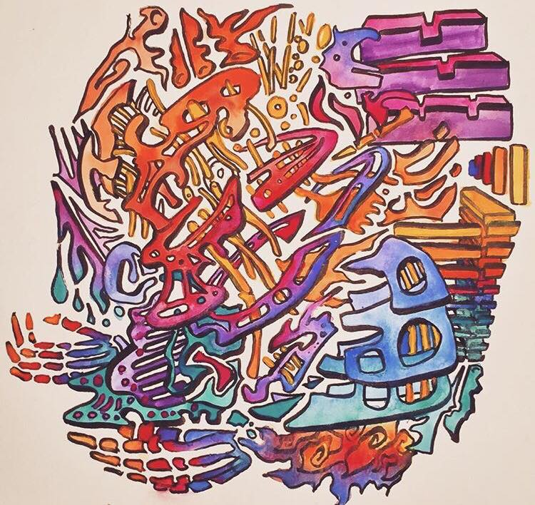
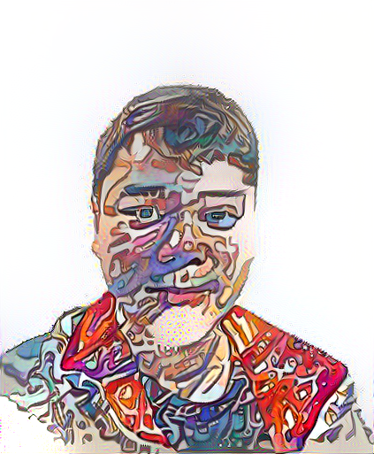

# Portraitizer
Creates portraits in a hand-drawn style using DeepLab, Neural Style Transfer, and my own original art

## Set Up

In order for the model to run smoothly, a GPU is recommended.
Download the [VGG-19 model weights](http://www.vlfeat.org/matconvnet/pretrained/) (see the "VGG-VD models from the *Very Deep Convolutional Networks for Large-Scale Visual Recognition* project" section).
After downloading, copy the weights file `imagenet-vgg-verydeep-19.mat` to the project directory.

## Usage

1) Create directories image_input, image_output, image2convert,and styles in project directory

2) Place any image you want to the styles folder to be used to transfer onto the content image

3) Run [Image Preprocessing.ipynb](https://github.com/tcc279/Portraitizer/blob/master/Image%20Preprocessing.ipynb)

4) Run [Neural Style Transfer.ipynb](https://github.com/tcc279/Portraitizer/blob/master/Neural%20Style%20Transfer.ipynb)

5) Outputs can then be found in the image_output folder 

Instructions on how to use the two Jupyter Notebooks can be found within the notebooks themselves

## Results

Here is one example:

More results can be found [here](https://github.com/tcc279/Portraitizer/tree/master/image_output)

Also contained in this repository:

- [Presentation of the Portraitizer as a PDF](https://github.com/tcc279/Portraitizer/blob/master/Portraitizer%20Presentation/Portraitizer.pdf)
- [Presentation Script](https://github.com/tcc279/Portraitizer/blob/master/Portraitizer%20Presentation/Portraitizer%20Script)

## Credits

DeepLab documentation can be found [here](https://github.com/tensorflow/models/tree/master/research/deeplab)

Neural style transfer uses cysmith's implemenation which can be found [here](https://github.com/cysmith/neural-style-tf)
